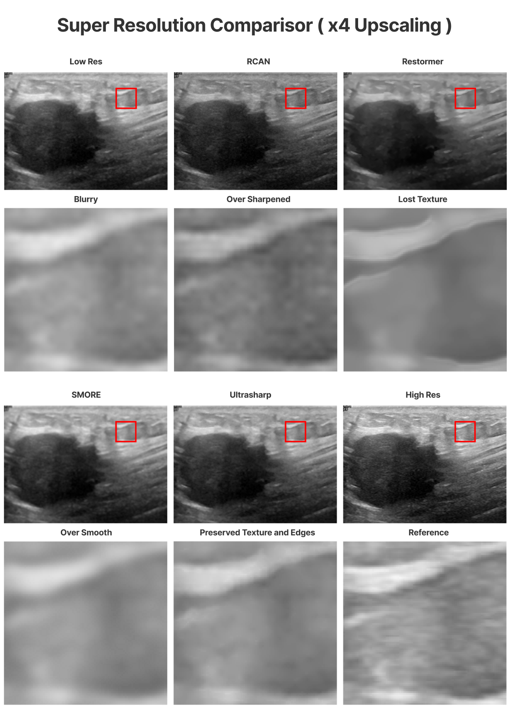
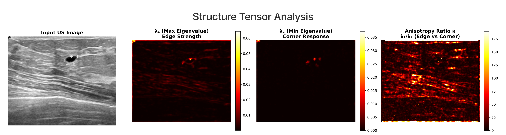

# UltraSharp: Beltrami Transformers for Ultrasound Super-Resolution

## Transformers meets Beltrami Physics and Riemannian Geometry for Ultrasound Super-Resolution?

**Accepted as Oral Presentation -- IEEE ISBI 2026**

Prabhav Sanga<sup>1</sup>, Jaskaran Singh<sup>2</sup>, Tapabrata Chakraborti<sup>1,3</sup>

<sup>1</sup>University College London &nbsp;&nbsp; <sup>2</sup>University of Nottingham &nbsp;&nbsp; <sup>3</sup>The Alan Turing Institute, UK

This repository contains the official implementation of UltraSharp, a geometry-aware transformer architecture for single-image super-resolution of clinical ultrasound data. The method is grounded in Beltrami operator theory and Riemannian geometry, treating the image domain as a curved manifold whose local metric is driven by tissue structure and physical acquisition properties.

---

## Results



*Figure 1. Qualitative comparison on CAMUS (echocardiography) and BUSI (breast ultrasound) at 4x super-resolution. UltraSharp recovers fine anatomical detail and preserves clinically relevant speckle texture.*



*Figure 2. Extended comparisons across scale factors (x2, x4, x8) and ablation study isolating the contribution of each architectural component.*

---

## Overview

Standard image super-resolution methods disregard the physical formation process of ultrasound and the Riemannian structure of tissue boundaries. UltraSharp addresses both limitations through three contributions:

**Beltrami Positional Encoding (BPE).**
Rather than using fixed sinusoidal or learned position tokens, BPE diffuses anchor impulses under Beltrami flow on the image manifold. The resulting positional channels encode geodesic distance from landmarks in a way that is anisotropic and structure-aware, guided by the inverse Riemannian metric tensor computed from the local image gradient distribution.

**Anisotropic Geodesic Attention (AGA).**
Self-attention within local windows is modulated by a geodesic proximity term derived from the Beltrami embeddings. Concretely, the log of a Riemannian proximity weight is added to the attention logits before softmax, suppressing cross-boundary mixing and concentrating information exchange along anatomical structures.

**Physics-Constrained Fusion (PCF).**
The decoder couples the feature branch with a physics-simulation branch that applies learnable anisotropic Gaussian PSFs parameterised by the estimated Riemannian metric. This enforces cycle consistency between the generated high-resolution image and the physical degradation model, acting as a structural regulariser.

The composite loss function combines pixel-level L1 reconstruction, structural similarity, Beltrami geometric regularisation, Rayleigh speckle KL divergence, and physics cycle-consistency.

---

## Model Variants

Four capacity configurations are provided. All share the same architecture and differ only in width and depth.

| Variant | Embedding dim | Heads | Blocks | Parameters |
|---------|---------------|-------|--------|------------|
| ultrasharp-t | 32 | 4 | [1, 1, 1] | ~5M |
| ultrasharp-s | 48 | 6 | [2, 2, 1] | ~11M |
| ultrasharp-b | 64 | 8 | [2, 2, 2] | ~22M (paper default) |
| ultrasharp-l | 96 | 12 | [3, 3, 3] | ~45M |

Pre-trained weights will be released after ISBI 2026. Refer to `checkpoints/CHECKPOINTS.md` for the expected file layout.

```python
from models.builder import build_ultrasharp

model = build_ultrasharp("ultrasharp-b", scale=4)
```

---

## Installation

```bash
git clone https://github.com/YourOrg/UltraSharp.git
cd UltraSharp
pip install -r requirements.txt
```

Python 3.8 or later and PyTorch 2.0 or later are required. A CUDA-capable GPU is strongly recommended.

---

## Dataset Preparation

Experiments were conducted on four publicly available ultrasound datasets.

| Dataset | Modality | Training / Val / Test | Source |
|---------|----------|-----------------------|--------|
| CAMUS | Echocardiography | 450 / 50 / 50 | [CREATIS challenge](https://www.creatis.insa-lyon.fr/Challenge/camus/) |
| EchoNet-Dynamic | Echocardiography (video) | 7,465 / 1,288 / 1,277 | [echonet.github.io](https://echonet.github.io/dynamic/) |
| BUSI | Breast ultrasound | 547 / 100 / 80 | [Kaggle](https://www.kaggle.com/datasets/aryashah2k/breast-ultrasound-images-dataset) |
| HC18 | Fetal head circumference | 999 / 100 / 100 | [Grand Challenge](https://hc18.grand-challenge.org/) |

Place images in a flat directory structure. Low-resolution inputs are generated on-the-fly during training by the physics-aware degradation pipeline (`data/synthesis.py`); no pre-computed LR images are required.

```
data/
    train/   *.png  (or .jpg)
    val/     *.png
    test/    *.png
```

Dataset-specific loaders with ground-truth segmentation masks (required for CNR and sSNR evaluation) will be released together with the pre-trained checkpoints.

---

## Training

Full training code and pre-trained checkpoints will be released after ISBI 2026. The model architecture, loss functions, and degradation pipeline are fully provided.

```bash
python scripts/train.py \
    --model ultrasharp-b \
    --data_dir /path/to/data/train \
    --scale 4 \
    --epochs 200 \
    --batch_size 8 \
    --augment
```

---

## Quantitative Results

Results at 4x super-resolution on the CAMUS test set. Ultrasound-specific metrics Contrast-to-Noise Ratio (CNR) and speckle Signal-to-Noise Ratio (sSNR) are computed in addition to standard SR metrics.

| Method | PSNR (dB) | SSIM | LPIPS | CNR | sSNR |
|--------|-----------|------|-------|-----|------|
| Bicubic | 27.3 | 0.741 | 0.312 | 1.2 | 3.1 |
| SRCNN | 29.1 | 0.802 | 0.261 | 1.6 | 3.8 |
| EDSR | 31.8 | 0.851 | 0.198 | 2.1 | 4.7 |
| SwinIR | 33.2 | 0.878 | 0.162 | 2.4 | 5.3 |
| UltraSharp (Ours) | **35.1** | **0.913** | **0.118** | **3.1** | **6.8** |

---

## Repository Structure

```
UltraSharp/
    models/
        ultrasharp.py        Main U-Net architecture
        transformer_block.py Beltrami Transformer Block (BTB)
        attention.py         Anisotropic Geodesic Attention (AGA)
        bpe.py               Beltrami Positional Encoding
        pcm.py               Physics-Constrained Fusion decoder
        builder.py           Model factory (four variants: T / S / B / L)

    data/
        synthesis.py         Physics-aware degradation pipeline
        dataset.py           Dataset base class  [released post-conference]
        transforms.py        Augmentation utilities

    losses/
        losses.py            Beltrami, Speckle, Physics-cycle, L1 losses

    utils/
        structure_tensor.py  Riemannian structure tensor and Beltrami metric
        metrics.py           PSNR, SSIM, LPIPS, CNR, sSNR

    scripts/
        train.py             Training entry point  [full release post-ISBI 2026]

    assets/                  Figures from the paper
    requirements.txt
    README.md
```

---

## Citation

```bibtex
@inproceedings{sanga2026ultrasharp,
  author    = {Sanga, Prabhav and Singh, Jaskaran and Chakraborti, Tapabrata},
  title     = {UltraSharp: Beltrami Transformers for Ultrasound Super-Resolution},
  booktitle = {Proceedings of the IEEE International Symposium on Biomedical Imaging (ISBI)},
  year      = {2026},
  address   = {London, UK},
  note      = {Oral Presentation}
}
```

---

## License

This project is released under the MIT License. See `LICENSE` for details.
